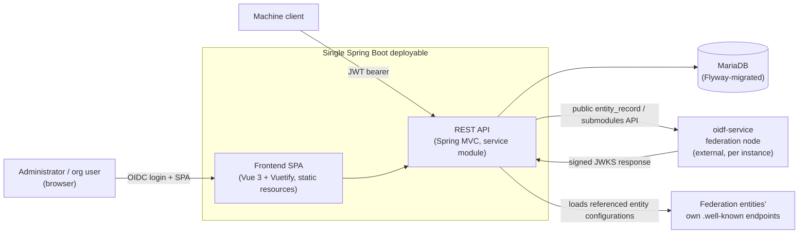

# Architecture Overview

A developer-oriented map of how the OpenID Federation Entity Registry is put together: what runs where, how a
request flows through the system, and where to look for a given concern.

## Table of Contents

- [System Context](#system-context)
- [Components](#components)
- [Backend Package Map](#backend-package-map)
- [Multi-tenancy and Authorization Model](#multi-tenancy-and-authorization-model)
- [Data Model](#data-model)
- [Build, Test and Deployment](#build-test-and-deployment)
- [Where to Go Next](#where-to-go-next)

---

## System Context

This registry is the **administrative backend** for an OpenID Federation. It does not itself speak the federation
wire protocol (`.well-known/openid-federation`, entity statement issuance, resolving) to relying parties — that is
the job of a separate **oidf-service** federation node, external to this codebase, deployed per federation
instance.

The relationship is two-way:

- The **oidf-service** node reads entity data from this registry through its public API,
  `GET /api/v1/federationservice/entity_record` and `/submodules` (see
  `federationservice.controller.OidfServiceApiController`), and uses it to publish signed subordinate statements.
- The **registry**, in turn, calls out to the oidf-service node for its published keys (`JwksKeysCacheService`)
  and validates the signed JWT responses using the public key configured per instance
  (`instances[i].oidf_service_api_validation_key`, see [Application Configuration](configuration.md)).

Administrators and organisation representatives interact with the registry through a browser SPA; machine clients
(and the SPA itself) talk to the same backend over a JSON REST API secured with JWT bearer tokens.

## Components

The frontend (`frontend/`) is a Vue 3 + Vuetify 3 SPA built with Vite; the production build is copied into
`service/src/main/resources/static` and served by the same Spring Boot process as the API — there is one
deployable artifact, not two services. See [Frontend Spec](frontend_spec.md) for UI conventions.

## Backend Package Map

All backend code lives in the single Maven module `service`, under
`se.swedenconnect.oidf.registry`. Domain logic is organized by bounded concept rather than by technical layer;
within each domain package you'll typically find the same shape: `controller`, `service`, `model`, `repository`,
`dto`, `mapper`.

| Package             | Owns                                                                                                                                                                                 |
|---------------------|--------------------------------------------------------------------------------------------------------------------------------------------------------------------------------------|
| `entity`            | Federation entities (hosted, federation, and their modules' association).                                                                                                            |
| `module`            | Trust anchor / intermediate configuration modules attached to entities.                                                                                                              |
| `organization`      | Organizations, instances (tenants) and instance-placement logic — see below.                                                                                                         |
| `subordinate`       | Subordinate entities published under an intermediate.                                                                                                                                |
| `trustmark`         | Trustmark issuers and trustmark subjects.                                                                                                                                            |
| `registrationflow`  | The step-by-step flow for onboarding a new entity to the federation (state machine under `process`).                                                                                 |
| `registrations`     | Registration requests/applications and their admin review, including scheduled cleanup (`scheduler`).                                                                                |
| `federationservice` | The public API the external oidf-service node reads from (`entity_record`, `submodules`).                                                                                            |
| `guioperations`     | Endpoints that exist to serve the SPA directly (e.g. `/tenants`, `/userinfo`), not general REST resources.                                                                           |
| `infrastructure`    | Cross-cutting concerns: `config` (Spring `@ConfigurationProperties`, security config), `auth` (JWT/OIDC, `org_rights`, rights model), `audit`, `persistence`, `error`, `validation`. |
| `validation`        | The generic, string-based property validation DSL — see [Validation](validation.md).                                                                                                 |

## Multi-tenancy and Authorization Model

A **tenant** is a configured *instance* (`RegistryProperties.InstanceProperties`, YAML key
`openid.federation.registry.instances[]`) — see [Application Configuration](configuration.md#federation-instances)
for the full property reference. Each `Organization` row is scoped to exactly one instance
(`uk_instance_org_number`).

Requests are authorized in two steps, both keyed off the `{tenant}/{orgNumber}` path variables most endpoints take:

1. **Org membership** — `OrganizationRecordClaimSelector` resolves the tenant slug to the instance's configured
   function group(s), then checks the caller's `org_rights` JWT claim has an entry for `{orgNumber}`. Unknown
   tenant or missing org → HTTP 403.
2. **Right level** — `@PreAuthorize("@orgRightsService.canRead/canWrite/canAdmin(...)")` on the controller method
   checks whether the org's entry holds at least the required `OrganizationRight` (`READ` < `WRITE` < `ADMIN`,
   hierarchical) on any of the tenant's configured function groups. A tenant may be backed by more than one
   function group; the effective right is the highest held across all of them.

A token carrying `org_rights: [{"superuser": true}]` bypasses both checks entirely.

Authentication itself supports two paths through the same Spring Security filter chain
(`infrastructure.config.SecurityConfig`): OAuth2 **resource server** (JWT bearer, for machine/API clients — parsed
by `RegistryJwtConverter` into `RegistryClaims`) and OAuth2 **login/OIDC** (browser session, for the SPA —
`RegistryOidcUser`, authenticated to Keycloak with `private_key_jwt`, publishing its own key at `GET /jwks`). Both
expose the same `org_rights`-derived rights to `OrgRightsService`. Claim parsing and the right/authority types
(`OrgRightsClaim`, `OrgRightsClaimParser`, `OrganizationRight`) come from
`se.swedenconnect.iam:iam-security-spring-boot-starter`; the tenant/multi-function-group matching and the
dual `org_rights`-or-`scope` bearer-token handling above remain this registry's own, since the library has no
tenant concept and its auto-configured resource-server converter only understands the `scope` claim. See
[Authorization Model](oauth.md) for the full JWT claim shape and endpoint-by-endpoint access rules.

## Data Model

Persistence is JPA/Hibernate over MariaDB, schema evolution managed by Flyway migrations under
`service/src/main/resources/db/migration`. Core tables mirror the package map above: `instance`, `organization`,
`entities` (federation/hosted), module tables per module type, `subordinate`, `trustmark_issuer`,
`trustmark_subject`, plus tables backing `registrationflow`/`registrations`. Function groups are **not** persisted
— they exist only in application configuration and are used purely for request-time routing and authorization.

## Build, Test and Deployment

- **Backend**: `mvn clean install` from the repo root builds and tests the `service` module (JUnit 5 + AssertJ,
  Testcontainers-backed MariaDB for integration tests named `*IT`). See the
  [Developer Guide](developer.md) for local setup.
- **Frontend**: standard Vite/npm build in `frontend/`, output copied into the backend's static resources so the
  two ship as one artifact.
- **End-to-end**: a separate Maven module, `guitest`, drives the running application through the browser with
  Playwright.
- **Containerization**: the `service` module builds its container image with Jib (no local Docker daemon needed
  for the image build itself; Docker is still used to run MariaDB for local dev and Testcontainers-based tests).
- **CI**: GitHub Actions (`.github/workflows`).

## Where to Go Next

- [Application Configuration](configuration.md) — every configuration property, including the tenant/instance and
  function-group setup referenced above.
- [Authorization Model](oauth.md) — the `org_rights` claim shape and per-endpoint access rules in full.
- [Registration Flow](use_case_registration_flow.md) — the detailed state machine for onboarding a new entity.
- [Audit Events](audit.md) — what gets audited and why.
- [Validation](validation.md) — the property validation rule DSL used across DTOs.
- [Frontend Spec](frontend_spec.md) — SPA technology choices and UI conventions.

---

Copyright &copy; 2026, [Sweden Connect](https://www.swedenconnect.se). Licensed under version 2.0 of
the [Apache License](https://www.apache.org/licenses/LICENSE-2.0).
